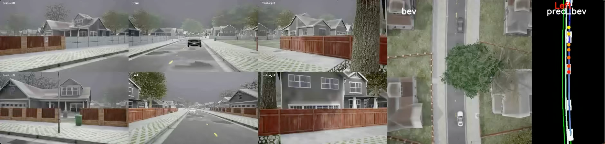
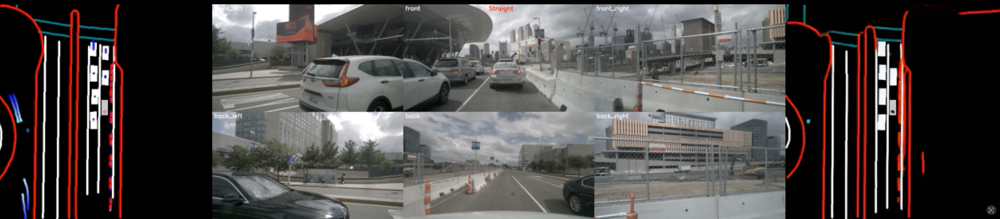
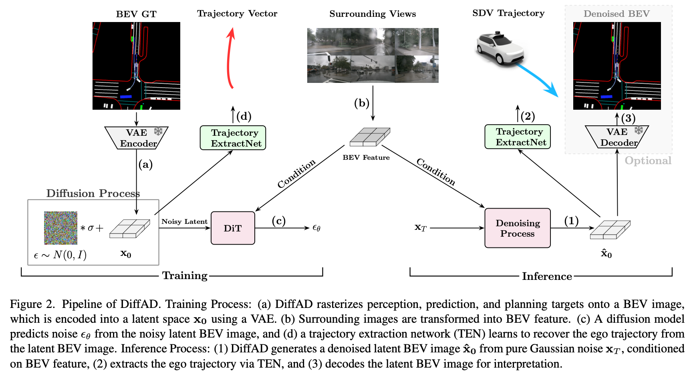
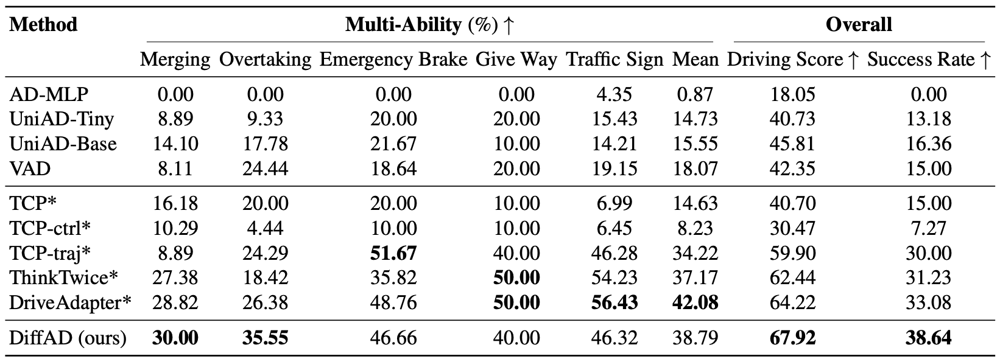

<h2 align="center">
  DiffAD: A Unified Diffusion Modeling Approach for Autonomous Driving
</h2>

<p align="center">
  
  
  
</p>

This repository contains PyTorch implementations, pretrained weights, and CARLA closed-loop evaluation code for our paper:

> [**DiffAD: A Unified Diffusion Modeling Approach for Autonomous Driving**](https://arxiv.org/abs/2503.12170)
> *Tao Wang, Cong Zhang, Xingguang Qu, Kun Li, Weiwei Liu, Chang Huang*
---

## 🚀 Demos（click to play on youtube）

### 1. Carla
[](https://www.youtube.com/watch?v=rGFvuOr2rYM)

### 2. nuScenes
[](https://www.youtube.com/watch?v=5FfvWAK_tXA)


## 🚧 Catalog
* [x] Code release
* [x] FlowMatching based BEV image generation to improve sampling efficiency
* [ ] Extract vectorized perception elements from generated BEV images
* [ ] Incorporate VLM to provide driving guidance as textual condition
* [ ] Evaluate performance in real-world scenarios

---

## 📚 Table of Contents

1. [Introduction](#introduction)
2. [Architecture](#architecture)
3. [Installation](#installation)
4. [Closed-loop Evaluation](#closed-loop-evaluation)
5. [Results on Bench2Drive](#results-on-bench2drive)
6. [Training](#training)
7. [Related Projects](#related-projects)
8. [License](#license)
9. [Citation](#citation)

---

## 🔍 Introduction <a id="introduction"></a>

**DiffAD** reformulates autonomous driving as a conditional image generation task via diffusion probabilistic models. Instead of relying on separate task-specific heads, DiffAD rasterizes all driving-relevant elements (e.g., agents, lanes) into a unified BEV image and models their joint latent distribution.

---

## 🧠 Architecture <a id="architecture"></a>

<h4 align="center">
  
</h4>

### 🎯 Highlights

* **All-in-One**: Unified image generation for perception, prediction, and planning
* **Diffusion-driven**: Generates BEV images via iterative denoising
* **Robust Driving**: Closed-loop performance demonstrate strong driving capability in interactive settings

---

## ⚙️ Installation <a id="installation"></a>

### 1. Create Environment

```bash
conda create -n b2d_diffad python=3.8
conda activate b2d_diffad
```

### 2. Install CUDA Toolkit (if needed)

```bash
conda install -c "nvidia/label/cuda-11.8.0" cuda-toolkit
```

### 3. Build MMCV

```bash
pip install -U openmim
mim install mmcv
```

### 4. Build BEVFormer Extensions

```bash
cd diffad/ops/bevformer
python3 setup.py build install
cd -
```

### 5. Install Python Dependencies

```bash
pip install -r requirements.txt
```

---

## 🚗 Closed-Loop Evaluation <a id="closed-loop-evaluation"></a>

### Step 1: Install CARLA

```bash
mkdir -p ~/carla && cd ~/carla
wget https://carla-releases.s3.us-east-005.backblazeb2.com/Linux/CARLA_0.9.15.tar.gz
wget https://carla-releases.s3.us-east-005.backblazeb2.com/Linux/AdditionalMaps_0.9.15.tar.gz

tar -xvf CARLA_0.9.15.tar.gz
cd Import && tar -xvf ../AdditionalMaps_0.9.15.tar.gz
cd .. && bash ImportAssets.sh
```

### Step 2: Set Python Path

```bash
export CARLA_ROOT=YOUR_CARLA_PATH
# Add carla egg to conda site-packages
echo "$CARLA_ROOT/PythonAPI/carla/dist/carla-0.9.15-py3.7-linux-x86_64.egg" >> $CONDA_PREFIX/lib/python3.8/site-packages/carla.pth
```

### Step 3: Download Pretrained Weights

* [sd-vae-ft-mse](https://huggingface.co/stabilityai/sd-vae-ft-mse): Please download and setting VAE model path in [config_b2d_carla.yaml](configs/config_b2d_carla.yaml) and other configs.

* [DiffAD](https://huggingface.co/want95/DiffAD): For convenience, our pre-trained DiffAD models can be downloaded directly here as well:

  | DiffAD Model  | Dataset | Diffusion Type | image-size (pc_range) | FID-20K |
  |---------------|----------|---------------|------------|---------|
  | [b2d-dpm-29k](https://huggingface.co/want95/DiffAD/tree/main) | Bench2Drive      | DDPM    |512x256 (-16, -32, 16, 32) |46.9          |
  | [b2d-fm-50k](https://huggingface.co/want95/DiffAD/tree/main) | Bench2Drive      | FlowMatching    | 512x256 (-16, -32, 16, 32) |61.4  |
  | [nus-fm-44k](https://huggingface.co/want95/DiffAD/tree/main) | nuScene          | FlowMatching    | 512x512 (-32, -32, 32, 32) |30.6  |
### Step 4: Launch Evaluation

```bash
export DiffAD_ROOT=YOUR_DiffAD_PATH
cd Bench2Drive
bash leaderboard/scripts/run_evaluation_multi_diffad.sh

# visualization
python tools/generate_video.py -f your_rgb_folder/
# metrics: driving score and multi-ability
sh metrics.sh
```

---

## 📊 Results on Bench2Drive <a id="results-on-bench2drive"></a>

<h4 align="center">
  
</h4>

---

## 🏋️ Training <a id="training"></a>

### Step 1: Prepare Data

Refer to:

* [Bench2Drive Dataset](https://github.com/Thinklab-SJTU/Bench2Drive?tab=readme-ov-file#Dataset)
* [nuScenes Dataset](https://www.nuscenes.org)

**Expected Directory Structure:**

```
data/
├── bench2drive/
│   ├── maps/
│   │   ├── Town01_HD_map.npz
│   │   └── ...
│   └── v1/
│       ├── Accident_Town03_Route101_Weather23/
│       └── ...
├── infos/
│   ├── b2d_infos_train.pkl
│   └── ...
├── nuscenes/
│   ├── nuscenes_infos_temporal_train.pkl
│   └── ...
```

### Step 2: Train Models

#### Bench2Drive

```bash
# Stage 1: Train perception only
torchrun --nnodes=1 --nproc_per_node=8 train.py --config configs/config_b2d_stage1.yaml --diffusion_type fm

# Stage 2: Joint train with stage1 checkpoint
torchrun --nnodes=1 --nproc_per_node=8 train.py --config configs/config_b2d_stage2.yaml --diffusion_type fm --ckpt 'path/to/model.pt'
```

#### nuScenes

```bash
# Stage 1: Train perception only
torchrun --nnodes=1 --nproc_per_node=8 train.py --config configs/config_nus_stage1.yaml --diffusion_type fm 

# Stage 2: Joint train with stage1 checkpoint
torchrun --nnodes=1 --nproc_per_node=8 train.py --config configs/config_nus_stage2.yaml --diffusion_type fm --ckpt 'path/to/model.pt'
```

### Step 3: Sampling & Evaluation (FID)

```bash
# Generate samples
torchrun --nnodes=1 --nproc_per_node=8 eval.py --config configs/config_b2d_stage2.yaml --diffusion_type fm --ckpt 'path/to/model.pt'

# Compute FID score
python cal_fid.py -f your_output_folder
```

---

## 🔗 Related Projects <a id="related-projects"></a>

* [Bench2Drive](https://github.com/Thinklab-SJTU/Bench2Drive): Driving benchmark on CARLA
* [DiT](https://github.com/facebookresearch/DiT?tab=readme-ov-file): Diffusion Transformer
* [FlowMatching](https://github.com/facebookresearch/flow_matching): Flow Matching


---

## 📄 License <a id="license"></a>
The code and model weights are licensed under CC-BY-NC. See [`LICENSE`](LICENSE) for details.

It also includes code from several third-party projects under their respective open source licenses.  
See the [THIRD_PARTY_LICENSES](./THIRD_PARTY_LICENSES) file for full details.

---

## 📖 Citation <a id="citation"></a>

If you find this project helpful, please consider citing:

```bibtex
@misc{wang2025diffad,
  title={DiffAD: A Unified Diffusion Modeling Approach for Autonomous Driving},
  author={Tao Wang and Cong Zhang and Xingguang Qu and Kun Li and Weiwei Liu and Chang Huang},
  year={2025},
  eprint={2503.12170},
  archivePrefix={arXiv},
  url={https://arxiv.org/abs/2503.12170},
}
```